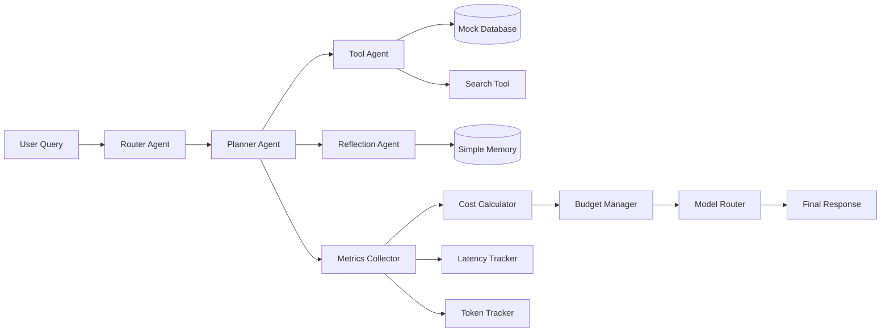

# Architecture Overview

```mermaid
flowchart LR
  U[User Query] --> R[Router Agent]
  R --> P[Planner Agent]
  P --> T[Tool Agent]
  T --> DB[(Mock Database)]
  T --> S[Search Tool]
  P --> F[Reflection Agent]
  F --> M[(Simple Memory)]
  P --> MON[Metrics Collector]
  MON --> C[Cost Calculator]
  MON --> L[Latency Tracker]
  MON --> TOK[Token Tracker]
  C --> B[Budget Manager]
  B --> MR[Model Router]
  MR --> O[Final Response]
```
