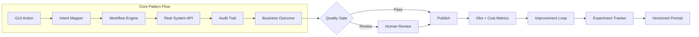

# Agentic AI from GUI to Real World Architecture

This diagram is extracted from the notebook so GitHub can render Mermaid reliably.

```mermaid
flowchart LR
  subgraph CoreFlow[Core Pattern Flow]
    GUI[GUI Action] --> MAP[Intent Mapper]
    MAP --> WF[Workflow Engine]
    WF --> API[Real System API]
    API --> AU[Audit Trail]
    AU --> O[Business Outcome]
  end
  O --> QG{Quality Gate}
  QG -->|Pass| PUB[Publish]
  QG -->|Review| HREV[Human Review]
  HREV --> PUB
  PUB --> OBS[Obs + Cost Metrics]
  OBS --> LOOP[Improvement Loop]
  LOOP --> EXP[Experiment Tracker]
  EXP --> VER[Versioned Prompt]
```
