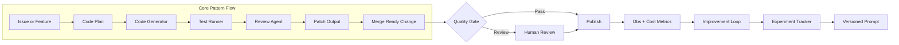

# Coding Agents Architecture

This diagram is extracted from the notebook so GitHub can render Mermaid reliably.

```mermaid
flowchart LR
  subgraph CoreFlow[Core Pattern Flow]
    I[Issue or Feature] --> PL[Code Plan]
    PL --> GEN[Code Generator]
    GEN --> TEST[Test Runner]
    TEST --> RV[Review Agent]
    RV --> PT[Patch Output]
    PT --> MR[Merge Ready Change]
  end
  MR --> QG{Quality Gate}
  QG -->|Pass| PUB[Publish]
  QG -->|Review| HREV[Human Review]
  HREV --> PUB
  PUB --> OBS[Obs + Cost Metrics]
  OBS --> LOOP[Improvement Loop]
  LOOP --> EXP[Experiment Tracker]
  EXP --> VER[Versioned Prompt]
```
